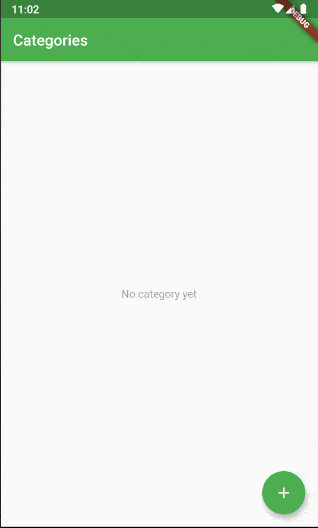

# flutter_ddd

Notes app sample in Dart / Flutter with DDD.

This is an outcome of my attempt to understand Domain-Driven Design and consider how I can introduce
it to app development in Flutter. The attempt began when I wondered what directory structure would be
better and started to try to figure it out.

DDD may be too much for a small app like this, resulting in unnecessarily bloated code, but should
help you more in development of larger apps.

## Branches

* master (current branch)
    * The original example with ChangeNotifier
* [state_notifier](https://github.com/kaboc/flutter_ddd/tree/state_notifier)
    * A newer example with StateNotifier (w/o Freezed)
        * I tried this to see if it could make things easier, but unfortunately I did not really see
        benefits from just separating states from notifiers and making the states immutable in this
        project. It may matter more in other projects.

## Related articles

- [Dart/Flutterでドメイン駆動設計（DDD）してみた - 導入編](https://kabochapo.hateblo.jp/entry/2019/11/01/195130) (Japanese)
    - This post describes what DDD and architectures are like and what structure I chose. 
- [Dart/Flutterでドメイン駆動設計（DDD）してみた - 実装編](https://kabochapo.hateblo.jp/entry/2019/11/21/160759) (Japanese)
    - This shows what I considered in implementing DDD in Dart / Flutter.

## References

- [Book: 現場で役立つシステム設計の原則](https://gihyo.jp/book/2017/978-4-7741-9087-7)
- [ボトムアップドメイン駆動設計 │ nrslib](https://nrslib.com/bottomup-ddd/)
- [ボトムアップドメイン駆動設計 後編 │ nrslib](https://nrslib.com/bottomup-ddd-2/)
- [「DDDのモデリングとは何なのか、 そしてどうコードに落とすのか」資料 / Q&A - little hands' lab](https://little-hands.hatenablog.com/entry/2019/08/31/genba_de_ddd)
- [ドメイン駆動設計(DDD) カテゴリーの記事一覧 - little hands' lab](https://little-hands.hatenablog.com/archive/category/%E3%83%89%E3%83%A1%E3%82%A4%E3%83%B3%E9%A7%86%E5%8B%95%E8%A8%AD%E8%A8%88%28DDD%29)

## Credits

* Icon by [Hamza Saleem](http://www.hamzasaleem.co.uk/), taken from [IconArchive.com](http://www.iconarchive.com/show/stock-style-3-icons-by-hamzasaleem/Notes-icon.html)
